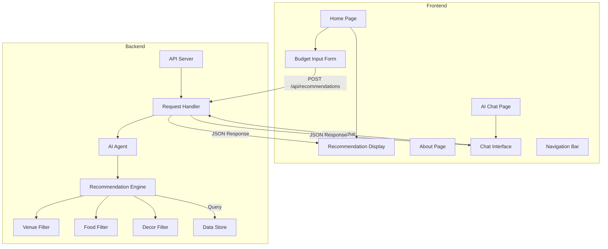

# Design Document: Event Planning Platform

## Overview

The event planning platform is a full-stack web application that helps event planners manage budgets and receive AI-powered recommendations. The system consists of a frontend web application with three main pages (Home, About, AI Chat) and a JSON-based backend API that processes user constraints and generates intelligent recommendations for venues, food, and decor options.

The architecture follows a client-server model where the frontend collects user input through forms and chat interfaces, sends requests to the backend API, and displays recommendations. The backend uses an agentic AI approach to process constraints and filter options based on budget, capacity, location, and user preferences.

## Architecture

### High-Level Architecture



### Technology Stack Considerations

Based on the project requirements:
- **Frontend**: Modern JavaScript framework (React, Vue, or similar) for reactive UI updates
- **Backend**: Node.js/Express or Python/Flask for JSON API server
- **AI Processing**: Integration with LLM API or local AI model for chat and recommendation logic
- **Data Storage**: JSON files or lightweight database for venue/food/decor options
- **Deployment**: Local server with configurable IP/port

## Components and Interfaces

### Frontend Components

#### 1. Navigation Bar Component
**Purpose**: Provides consistent navigation across all pages

**Interface**:
```typescript
interface NavigationBar {
  currentPage: string;
  navigateTo(page: string): void;
}
```

**Behavior**:
- Displays links to Home, About, and AI Chat pages
- Highlights the current active page
- Handles page navigation events

#### 2. Budget Input Form Component
**Purpose**: Collects event constraints from users

**Interface**:
```typescript
interface BudgetInputForm {
  timeRange: {
    startDate: Date;
    endDate: Date;
  };
  budget: {
    min: number;
    max: number;
  };
  location: string;
  attendees: number;
  foodOptions: string[];
  decorOptions: string[];
  
  validateForm(): ValidationResult;
  submitForm(): Promise<RecommendationResponse>;
  onFieldChange(field: string, value: any): void;
}

interface ValidationResult {
  isValid: boolean;
  errors: Map<string, string>;
}
```

**Behavior**:
- Validates all required fields before submission
- Provides real-time validation feedback
- Handles form state management
- Triggers API call on valid submission
- Updates recommendations when constraints change

#### 3. Recommendation Display Component
**Purpose**: Shows filtered venue, food, and decor options

**Interface**:
```typescript
interface RecommendationDisplay {
  venues: VenueOption[];
  foodOptions: FoodOption[];
  decorOptions: DecorOption[];
  
  displayRecommendations(response: RecommendationResponse): void;
  showEmptyState(message: string): void;
}

interface VenueOption {
  id: string;
  name: string;
  location: string;
  capacity: number;
  pricePerDay: number;
  amenities: string[];
}

interface FoodOption {
  id: string;
  name: string;
  type: string;
  pricePerPerson: number;
  minAttendees: number;
  dietaryOptions: string[];
}

interface DecorOption {
  id: string;
  name: string;
  style: string;
  totalPrice: number;
  description: string;
}
```

**Behavior**:
- Renders recommendations in organized sections
- Displays pricing and relevant details
- Shows empty state when no options match constraints
- Updates dynamically when new recommendations arrive

#### 4. Chat Interface Component
**Purpose**: Enables conversational interaction with AI agent

**Interface**:
```typescript
interface ChatInterface {
  messages: ChatMessage[];
  
  sendMessage(content: string): Promise<void>;
  displayMessage(message: ChatMessage): void;
  clearChat(): void;
}

interface ChatMessage {
  id: string;
  sender: 'user' | 'ai';
  content: string;
  timestamp: Date;
  recommendations?: RecommendationResponse;
}
```

**Behavior**:
- Maintains conversation history
- Sends user messages to backend
- Displays AI responses with formatting
- Includes recommendations in chat when relevant
- Preserves session state

#### 5. Hero Section Component
**Purpose**: Provides engaging landing experience

**Interface**:
```typescript
interface HeroSection {
  title: string;
  subtitle: string;
  ctaButton: {
    text: string;
    action: () => void;
  };
}
```

**Behavior**:
- Displays value proposition
- Provides call-to-action
- Responsive design for different screen sizes

### Backend Components

#### 1. API Server
**Purpose**: Handles HTTP requests and routes to appropriate handlers

**Interface**:
```typescript
interface APIServer {
  port: number;
  ipAddress: string;
  
  start(): void;
  stop(): void;
  configureRoutes(): void;
}
```

**Endpoints**:
- `POST /api/recommendations` - Get recommendations based on constraints
- `POST /api/chat` - Send chat message and receive AI response
- `GET /api/health` - Health check endpoint

#### 2. Request Handler
**Purpose**: Validates and processes incoming API requests

**Interface**:
```typescript
interface RequestHandler {
  handleRecommendationRequest(request: RecommendationRequest): Promise<RecommendationResponse>;
  handleChatRequest(request: ChatRequest): Promise<ChatResponse>;
  validateRequest(request: any): ValidationResult;
}

interface RecommendationRequest {
  timeRange: {
    startDate: string;
    endDate: string;
  };
  budget: {
    min: number;
    max: number;
  };
  location: string;
  attendees: number;
  foodOptions: string[];
  decorOptions: string[];
}

interface RecommendationResponse {
  venues: VenueOption[];
  foodOptions: FoodOption[];
  decorOptions: DecorOption[];
  totalEstimate: {
    min: number;
    max: number;
  };
  message?: string;
}

interface ChatRequest {
  message: string;
  context?: RecommendationRequest;
  conversationHistory?: ChatMessage[];
}

interface ChatResponse {
  message: string;
  recommendations?: RecommendationResponse;
}
```

**Behavior**:
- Validates JSON structure and required fields
- Returns appropriate error responses for invalid requests
- Delegates to AI Agent for processing
- Formats responses in consistent JSON structure

#### 3. AI Agent
**Purpose**: Orchestrates recommendation generation and chat responses

**Interface**:
```typescript
interface AIAgent {
  processConstraints(constraints: RecommendationRequest): Promise<RecommendationResponse>;
  generateChatResponse(request: ChatRequest): Promise<ChatResponse>;
  analyzeConstraints(constraints: RecommendationRequest): ConstraintAnalysis;
}

interface ConstraintAnalysis {
  budgetPerDay: number;
  durationDays: number;
  budgetBreakdown: {
    venue: number;
    food: number;
    decor: number;
  };
  feasibilityScore: number;
}
```

**Behavior**:
- Analyzes user constraints to determine feasibility
- Calculates budget breakdown across categories
- Delegates filtering to Recommendation Engine
- Generates natural language explanations
- Provides suggestions when constraints are too restrictive

#### 4. Recommendation Engine
**Purpose**: Filters and ranks options based on constraints

**Interface**:
```typescript
interface RecommendationEngine {
  filterVenues(constraints: RecommendationRequest, analysis: ConstraintAnalysis): VenueOption[];
  filterFood(constraints: RecommendationRequest, analysis: ConstraintAnalysis): FoodOption[];
  filterDecor(constraints: RecommendationRequest, analysis: ConstraintAnalysis): DecorOption[];
  rankOptions<T>(options: T[], constraints: RecommendationRequest): T[];
}
```

**Behavior**:
- Queries data store for available options
- Applies hard constraints (budget, capacity, location)
- Applies soft constraints (preferences)
- Ranks results by relevance and value
- Returns top recommendations

#### 5. Data Store
**Purpose**: Manages venue, food, and decor option data

**Interface**:
```typescript
interface DataStore {
  getVenues(filters?: VenueFilters): VenueOption[];
  getFoodOptions(filters?: FoodFilters): FoodOption[];
  getDecorOptions(filters?: DecorFilters): DecorOption[];
  addVenue(venue: VenueOption): void;
  addFoodOption(food: FoodOption): void;
  addDecorOption(decor: DecorOption): void;
}

interface VenueFilters {
  location?: string;
  minCapacity?: number;
  maxPricePerDay?: number;
}

interface FoodFilters {
  type?: string;
  maxPricePerPerson?: number;
  dietaryOptions?: string[];
}

interface DecorFilters {
  style?: string;
  maxTotalPrice?: number;
}
```

**Behavior**:
- Loads option data from JSON files or database
- Provides efficient querying with filters
- Supports adding new options
- Maintains data consistency

## Data Models

### Event Constraints Model
```typescript
interface EventConstraints {
  timeRange: {
    startDate: Date;
    endDate: Date;
  };
  budget: {
    min: number;
    max: number;
  };
  location: string;
  attendees: number;
  foodOptions: string[];
  decorOptions: string[];
}
```

**Validation Rules**:
- `startDate` must be before `endDate`
- `budget.min` must be less than or equal to `budget.max`
- `budget.min` and `budget.max` must be positive numbers
- `attendees` must be a positive integer
- `location` must be a non-empty string
- `foodOptions` and `decorOptions` are optional arrays

### Venue Option Model
```typescript
interface VenueOption {
  id: string;
  name: string;
  location: string;
  capacity: number;
  pricePerDay: number;
  amenities: string[];
  description: string;
  images?: string[];
}
```

**Constraints**:
- `capacity` must be positive integer
- `pricePerDay` must be positive number
- `location` should match user's location preference or be nearby

### Food Option Model
```typescript
interface FoodOption {
  id: string;
  name: string;
  type: string; // e.g., "buffet", "plated", "cocktail"
  pricePerPerson: number;
  minAttendees: number;
  maxAttendees?: number;
  dietaryOptions: string[]; // e.g., "vegetarian", "vegan", "gluten-free"
  description: string;
}
```

**Constraints**:
- `pricePerPerson` must be positive number
- `minAttendees` must be positive integer
- `maxAttendees` (if present) must be greater than `minAttendees`

### Decor Option Model
```typescript
interface DecorOption {
  id: string;
  name: string;
  style: string; // e.g., "modern", "rustic", "elegant"
  totalPrice: number;
  description: string;
  includes: string[];
  images?: string[];
}
```

**Constraints**:
- `totalPrice` must be positive number
- `style` should match user preferences when specified

### Chat Message Model
```typescript
interface ChatMessage {
  id: string;
  sender: 'user' | 'ai';
  content: string;
  timestamp: Date;
  recommendations?: RecommendationResponse;
}
```

**Constraints**:
- `id` must be unique
- `content` must be non-empty string
- `timestamp` must be valid date

## Correctness Properties

*A property is a characteristic or behavior that should hold true across all valid executions of a system—essentially, a formal statement about what the system should do. Properties serve as the bridge between human-readable specifications and machine-verifiable correctness guarantees.*


### Property 1: Form Field Completeness
*For any* Budget Input Form instance, it should contain all required fields: time range (start and end date), budget (min and max), location, attendees, food options, and decor options.
**Validates: Requirements 1.2, 1.3, 1.4, 1.5, 1.6, 1.7**

### Property 2: Form Validation Completeness
*For any* form submission with missing or invalid required fields, the validation should fail and return error messages identifying all problematic fields.
**Validates: Requirements 1.8, 1.9**

### Property 3: Venue Filtering Correctness
*For any* set of event constraints and venue options, all returned venues should satisfy the location requirement, have capacity greater than or equal to the attendee count, and have price per day within the allocated venue budget.
**Validates: Requirements 2.2**

### Property 4: Food Filtering Correctness
*For any* set of event constraints and food options, all returned food options should accommodate the attendee count (between min and max attendees), match food preferences when specified, and have total cost (price per person × attendees) within the allocated food budget.
**Validates: Requirements 2.3**

### Property 5: Decor Filtering Correctness
*For any* set of event constraints and decor options, all returned decor options should match style preferences when specified and have total price within the allocated decor budget.
**Validates: Requirements 2.4**

### Property 6: Recommendation Display Completeness
*For any* recommendation response (venue, food, or decor option), the displayed output should include all required information: name, pricing details (price per day for venues, price per person for food, total price for decor), and capacity/attendee information where applicable.
**Validates: Requirements 2.5, 2.6, 2.7**

### Property 7: Reactive Constraint Updates
*For any* two different sets of event constraints that would produce different filtered results, modifying the form from the first constraint set to the second should result in updated recommendations reflecting the new constraints.
**Validates: Requirements 3.1, 3.3**

### Property 8: Form State Persistence
*For any* form state with populated fields, triggering a recommendation update should preserve all form field values without loss.
**Validates: Requirements 3.4**

### Property 9: Chat Message Ordering
*For any* sequence of chat messages with different timestamps, the displayed conversation history should be ordered chronologically from earliest to latest.
**Validates: Requirements 4.3**

### Property 10: Chat Session Persistence
*For any* chat session, adding new messages should preserve all previously sent messages in the conversation history.
**Validates: Requirements 4.5**

### Property 11: Chat Recommendation Formatting
*For any* AI-generated recommendation in chat, the formatted output should include the required fields for each option type (venues with pricing and capacity, food with price per person, decor with total price).
**Validates: Requirements 4.6**

### Property 12: Navigation Functionality
*For any* navigation link in the navigation bar, clicking it should change the current page to the corresponding target page.
**Validates: Requirements 5.5**

### Property 13: Active Page Indication
*For any* current page, the navigation bar should visually indicate that page as active.
**Validates: Requirements 5.6**

### Property 14: Interactive Feedback
*For any* interactive UI element (button, form input, link), user interaction should produce visual feedback (state change, animation, or style update).
**Validates: Requirements 6.4**

### Property 15: JSON Request Acceptance
*For any* valid EventConstraints object, serializing it to JSON and sending it to the API should result in successful parsing and processing (not a malformed request error).
**Validates: Requirements 7.1**

### Property 16: JSON Response Format
*For any* successful API response, the response body should be valid JSON that can be parsed without errors.
**Validates: Requirements 7.2**

### Property 17: API Response Structure
*For any* valid recommendation request, the API response should contain the required fields: venues (array), foodOptions (array), decorOptions (array), and each should be properly structured.
**Validates: Requirements 7.3**

### Property 18: Error Response Format
*For any* error condition (validation failure, malformed request, server error), the API response should be valid JSON containing an error message field.
**Validates: Requirements 7.4**

### Property 19: Request Validation
*For any* malformed JSON request or request missing required fields, the API should reject it with an appropriate error response rather than processing it.
**Validates: Requirements 7.5**

## Error Handling

### Frontend Error Handling

**Form Validation Errors**:
- Display inline error messages next to invalid fields
- Prevent form submission until all errors are resolved
- Provide clear, actionable error messages (e.g., "End date must be after start date")
- Highlight invalid fields with visual indicators

**API Communication Errors**:
- Network failures: Display user-friendly message "Unable to connect to server. Please check your connection."
- Timeout errors: Display "Request timed out. Please try again."
- Server errors (5xx): Display "Server error occurred. Please try again later."
- Maintain form state so users don't lose their input

**Empty Results Handling**:
- When no options match constraints: Display helpful message explaining why (e.g., "No venues found within budget. Try increasing your budget or adjusting dates.")
- Provide suggestions for adjusting constraints
- Show which constraint is most restrictive

**Chat Interface Errors**:
- Message send failures: Show retry option
- AI response errors: Display "Unable to generate response. Please try again."
- Maintain conversation history even if individual messages fail

### Backend Error Handling

**Request Validation**:
- Return 400 Bad Request for malformed JSON
- Return 422 Unprocessable Entity for invalid constraint values
- Include detailed error messages in response body
- Validate all required fields before processing

**Data Access Errors**:
- Handle missing data files gracefully
- Return empty arrays rather than errors when no options exist
- Log data access errors for debugging

**AI Processing Errors**:
- Catch and log AI agent exceptions
- Return fallback response when AI processing fails
- Ensure system remains functional even if AI features fail

**Server Errors**:
- Return 500 Internal Server Error for unexpected exceptions
- Log full error details for debugging
- Return sanitized error messages to clients (don't expose internal details)

**Error Response Format**:
```typescript
interface ErrorResponse {
  error: {
    code: string;
    message: string;
    details?: any;
  };
}
```

## Testing Strategy

### Dual Testing Approach

This feature requires both unit testing and property-based testing for comprehensive coverage:

**Unit Tests**: Focus on specific examples, edge cases, and integration points
- Specific form validation scenarios (empty fields, invalid dates, negative budgets)
- API endpoint integration tests
- Component rendering tests
- Error handling scenarios
- Configuration loading tests

**Property-Based Tests**: Verify universal properties across all inputs
- Generate random event constraints and verify filtering correctness
- Generate random form states and verify validation behavior
- Generate random recommendation sets and verify display completeness
- Test with 100+ iterations per property to ensure comprehensive coverage

### Property-Based Testing Configuration

**Testing Library**: Use `fast-check` for JavaScript/TypeScript or `hypothesis` for Python

**Test Configuration**:
- Minimum 100 iterations per property test
- Each test must reference its design document property
- Tag format: `Feature: event-planning-platform, Property {number}: {property_text}`

**Example Property Test Structure**:
```typescript
// Feature: event-planning-platform, Property 3: Venue Filtering Correctness
test('all returned venues meet constraints', () => {
  fc.assert(
    fc.property(
      eventConstraintsGenerator(),
      venueOptionsGenerator(),
      (constraints, venues) => {
        const filtered = filterVenues(constraints, venues);
        return filtered.every(venue =>
          venue.location === constraints.location &&
          venue.capacity >= constraints.attendees &&
          venue.pricePerDay <= calculateVenueBudget(constraints)
        );
      }
    ),
    { numRuns: 100 }
  );
});
```

### Testing Coverage

**Frontend Testing**:
- Component unit tests for each major component
- Property tests for form validation (Property 2)
- Property tests for recommendation display (Property 6)
- Property tests for navigation (Properties 12, 13)
- Integration tests for API communication
- Visual regression tests for UI consistency

**Backend Testing**:
- Unit tests for each API endpoint
- Property tests for filtering logic (Properties 3, 4, 5)
- Property tests for JSON handling (Properties 15, 16, 17, 18, 19)
- Unit tests for error handling scenarios
- Integration tests for AI agent behavior
- Load tests for concurrent requests

**End-to-End Testing**:
- User flow tests (form submission → recommendations display)
- Chat interaction tests
- Navigation flow tests
- Error recovery tests

### Test Data Generation

**Generators for Property Tests**:
- `eventConstraintsGenerator()`: Generates valid and invalid constraint combinations
- `venueOptionsGenerator()`: Generates diverse venue options with varying properties
- `foodOptionsGenerator()`: Generates food options with different pricing and capacities
- `decorOptionsGenerator()`: Generates decor options with various styles and prices
- `chatMessageGenerator()`: Generates chat messages with timestamps

**Edge Cases to Cover**:
- Empty constraint fields
- Zero or negative budgets
- Past dates
- Very large attendee counts
- Budget too small for any options
- Constraints that match no options
- Constraints that match all options
- Boundary values (min/max budgets, capacity limits)

### Continuous Testing

- Run unit tests on every commit
- Run property tests in CI/CD pipeline
- Monitor test execution time (property tests may be slower)
- Track test coverage metrics
- Fail builds on test failures or coverage drops
